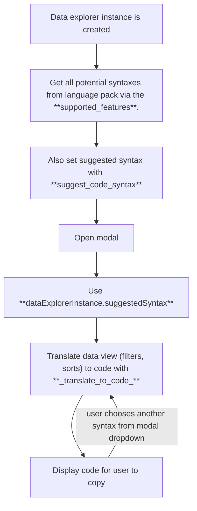

# data explorer: update comms with convert to code messages

> <https://github.com/posit-dev/ark/pull/873>
> 
> * Author: @isabelizimm
> * State: MERGED
> * Labels: 

related to: https://github.com/posit-dev/positron/issues/8531

This PR implements 2 new comm messages and a new feature type on the `supported_features` backend state:
- **add `convert_to_code` as a supported feature:** there are other supported features, such as row filters and column filters. This structure includes if it is supported as well as supported syntaxes, as an array of values.
- **`suggest_code_syntax` message:** for a particular data explorer instance, decide what options a user has for generating code. I would expect the return value of this to be `base-r` or something to that effect.
- **`convert_to_code` message:** for a particular data explorer instance, this message sends over the filters and sorts applied to the data and the desired syntax. The expectation is that this will return a code snippet string. The front end will (eventually) apply code highlighting and formatting.

Below is a diagram of the general flow through comms. Note that these comm messages will not call each other; they will be triggered by a modal in Positron core.

## @jennybc at 2025-07-15T23:45:49Z

I started with an early review of https://github.com/posit-dev/positron/pull/8536. So I'll let this age a bit, while we converse over there.